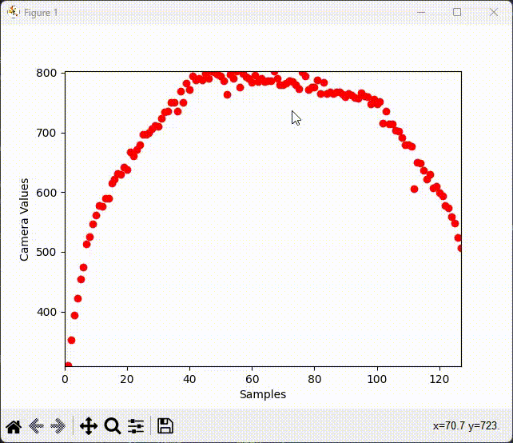
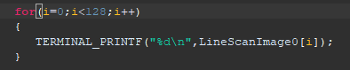

# Linescan Camera Serial Data Grapher

Graphs the linescan data outputted to the serial terminal in 'real-time'.


## Installation & Dependencies

### **Install python3 for your OS**

**Windows**

https://www.python.org/downloads/

**Debian Or Ubuntu Based Distros**
```bash
    sudo apt-get update
    sudo apt-get install python3.6
```
Change this portion ```python3.x``` to whatever is relavent at the time. 

Once installed, verify version

```
    python3 --version
    $> Python 3.10.4
```

Now install all the packages needed,

```
    $> pip install -r requirements.txt
```

---

If requirements.txt is not working then here are the packages manually.

### **Install matplotlib**

https://matplotlib.org/stable/users/installing/index.html

### **Install pyserial**

https://pyserial.readthedocs.io/en/latest/pyserial.html#installation

    
## Usage/Examples
Running the script
```bash
$> python graphVisualizer.py [COM port]
```

:warning: Make sure the FRDM board is connection properly and that it is outputting the linescan
data specified in the formatting section. Make sure the correct COM port is specified as an argument.


## Demo
Graph updating to change of linescan camera data.



## Formatting
For the graphVisualizer.py to graph correctly the Serial terminal must output in the correct format that the program is looking for.



This is an example of how the serial terminal should be outputting the linescan information for the first buffer. The graphVisualizer will do the rest.

## Tools
An extra program is supplied (SerialSniffer.py) to aid in the debugging process. It simply prints out all serial communication.

```
    $> python SerialSniffer.py [COM Port]
```

## Support

For support, email ruizmic1024@gmail.com with subject "Dude your code stinks"

